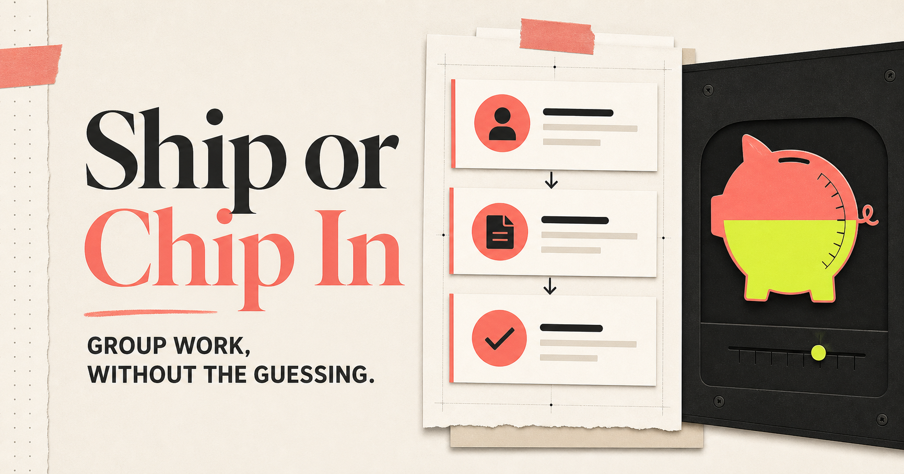

# Ship or Chip In

**Group work, without the guessing.**

[Live demo](https://ship-or-chip-in.jiyun956706.chatgpt.site) · Hackathon code: `auth0-sanfrancisco-2026`



Ship or Chip In is a multi-user accountability app for project teams. Teammates create clear tasks, submit proof of work, review one another fairly, and—only with explicit consent—attach a Stripe Sandbox contribution to a missed commitment. Successful test contributions fill a communal piggy bank for a shared team goal.

## How it works

1. Sign in with Auth0 and invite teammates.
2. Create tasks manually or import assigned action items from meeting notes.
3. Add an owner, deadline, acceptance criteria, and optional test contribution.
4. Submit a link to the completed work.
5. Teammates approve or reject the submission; owners cannot review themselves.
6. Health or family emergencies can pause the deadline or pending contribution for an appeal.
7. A failed, authorized task triggers a Stripe Sandbox contribution after the demo appeal window.

No real money is charged or held.

## Built around the event stack

- **Stripe Projects** provisions and manages the Auth0 integration.
- **Auth0** provides real multi-user authentication and teammate identity.
- **Stripe** powers the test subscription, saved test payment method, and automatic Sandbox contributions.
- **Persistent team state** keeps tasks, votes, appeals, invites, activity, and the communal pot synchronized.
- **Monetization is part of the workflow:** payment consent, failure resolution, appeals, and shared outcomes are connected rather than added as a separate checkout screen.

## Stack

Next.js 16 · React 19 · TypeScript · Auth0 · Stripe · Stripe Projects · Cloudflare D1 · Vinext

## Run locally

Requires Node.js `>=22.13.0`. Use your own Auth0 application and Stripe Sandbox credentials.

```bash
npm install
cp .env.example .env.local
npm run dev
```

## Verify

```bash
npm run lint
npm test
```
